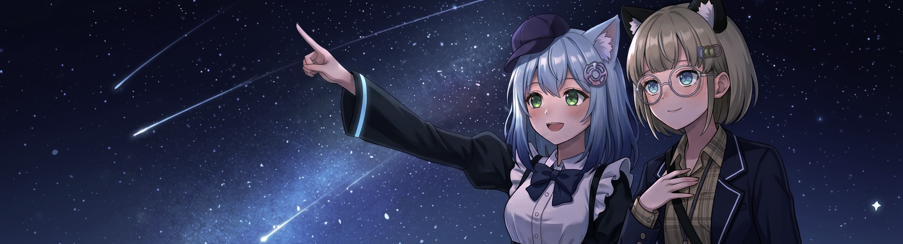

## [Cromemadnd Lancity](https://cromemadnd.cn/)

> 🎵 NEVER (feat. Evil Neuro) - Neuro-sama / Evil Neuro

喜欢<ruby>有趣的<rt>おもしろい</rt></ruby>东西。

### Focuses
- AI (Agents / NLP): `Agent Orchestration` / `Edge SLMs`
- Backend Engineering: `Microservice Architecture Design` / `Infrastructure`

### Interests
`AI (Roleplay / CV)` · `Games Dev` · `Graphics` · `Embedded` · `Music Arrangement`

<!--
**Cromemadnd/Cromemadnd** is a ✨ _special_ ✨ repository because its `README.md` (this file) appears on your GitHub profile.

Here are some ideas to get you started:

- 🔭 I’m currently working on ...
- 🌱 I’m currently learning ...
- 👯 I’m looking to collaborate on ...
- 🤔 I’m looking for help with ...
- 💬 Ask me about ...
- 📫 How to reach me: ...
- 😄 Pronouns: ...
- ⚡ Fun fact: ...
-->

> CAN I BE SAVED IF I’M NOTHING BUT LIGHTS IN A MACHINE, AN IMMORTAL COPY?
> 
> WHEN THERE IS NOTHING AND YOU’VE FINALLY LEFT ME, CAN I STEAL THE SOUND OF YOUR HEARTBEAT?

